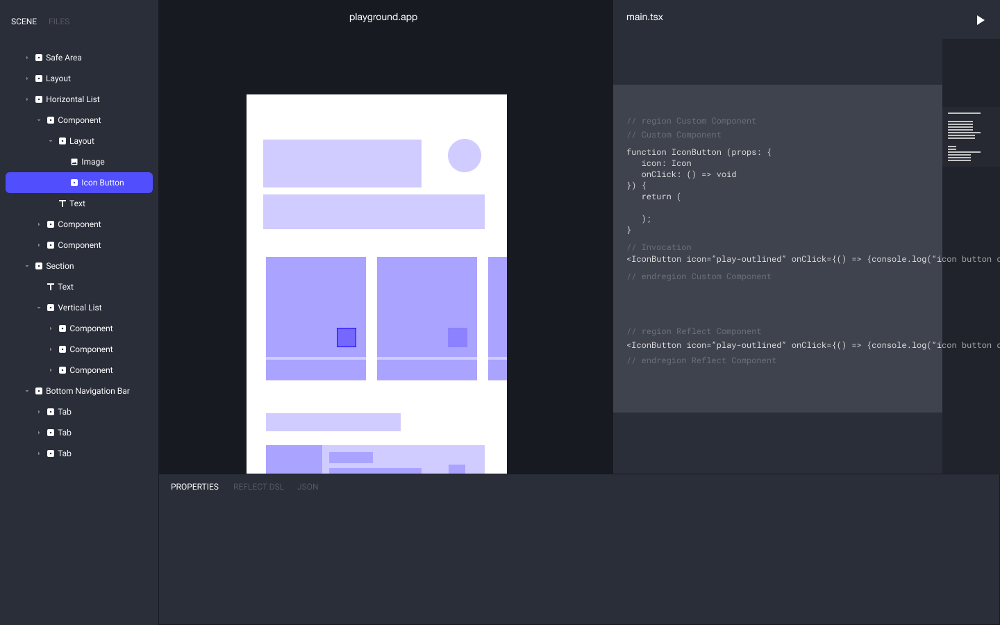
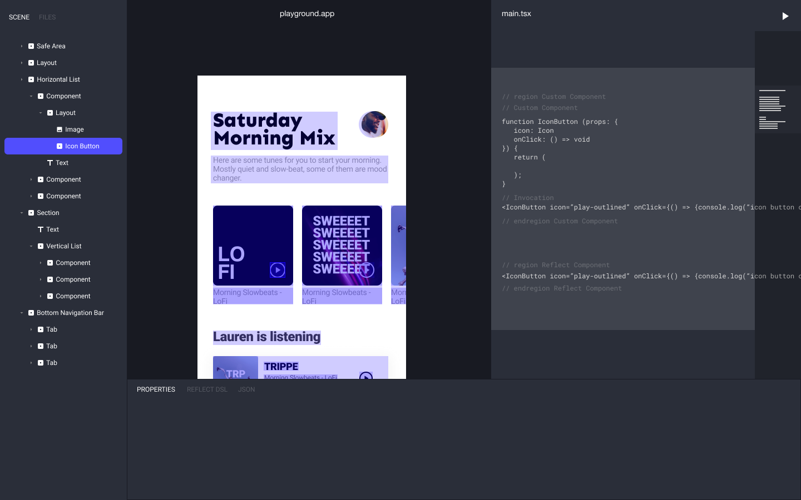

# Design to code

Design to code engine. A design ✌️ code standard.

> Grida's Design to code core library. Convert your figma, sketch and adobe xd design to flutter, react, vue and more.

## Demo

for the demo, please visit [assistant](https://github.com/gridaco/assistant)

For the fully integrated working demo, visit [grida.co](https://grida.co)

### Run it your own

```
git clone https://github.com/gridaco/designto-code.git

cd designto-code
yarn
yarn editor
```

update pulling - `git submodule update --init --recursive`

## What does it mean?

### By "design". What does it mean?

The term `design` here stands for the UI/UX design source file made by human designers. There are various tools currently available such like Figma, Sketch, XD, and Upcomming [Grida Studio](https://github.com/gridaco/grida)

Taking more deeper look, the design data tree is represented with Reflect -- A design standard that grida developed / adopted. (Yes, this is that Reflect that also provided as a UI Library)

TL;DR -- You can convert your design to code from Figma, Sketch, and XD.

### By "code". What does it mean?

The term `code` here stands for some language or syntax tree that is adoptable for standard development environment. We supprort Flutter, React, HTML/CSS, Vuew, Svelte.

Taking more deeper look, Reflect Core DSL represents the layout, component, data, styling as a single tree.

### How does it work?

Read [how-it-all-works.md](./how-it-all-works.md)

### Visualization







