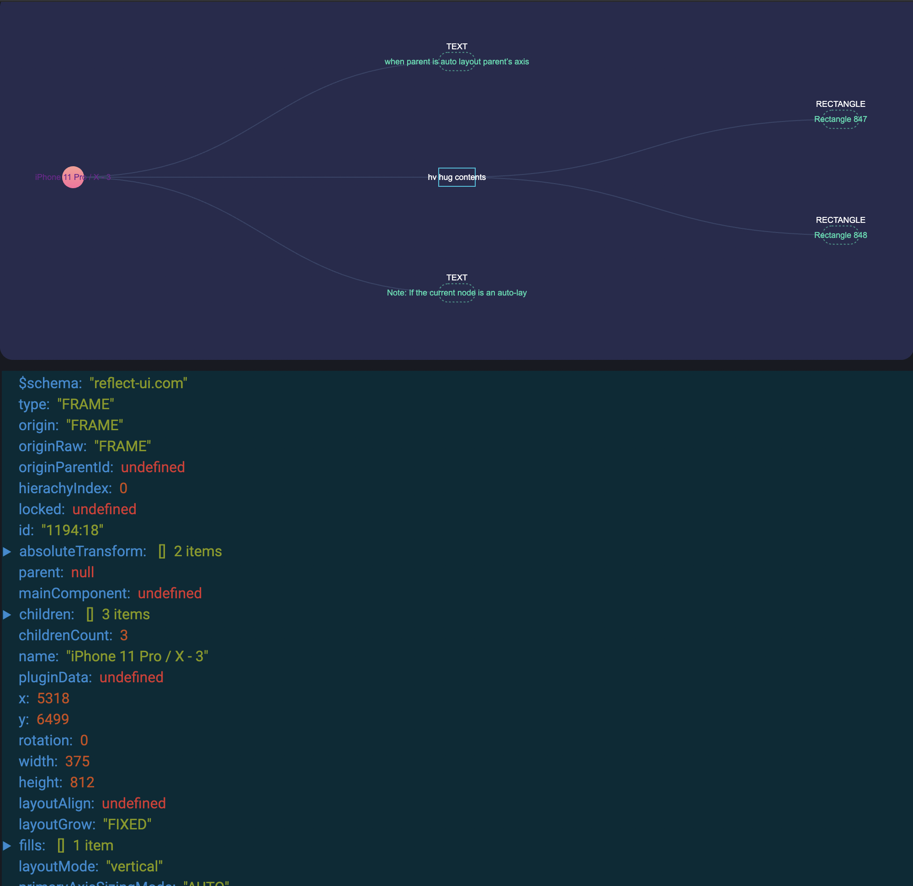

# design-to-code

Design to code engine. A design ✌️ code standard.

> Bridged's Design to code core library.

## Demo

for the demo, please visit [assistant](https://github.com/bridgedxyz/assistant)

## What does it mean?

### By "design". What does it mean?

The term `design` here stands for the UI/UX design source file made by human designers. There are various tools currently available such like Figma, Sketch, XD, and Upcomming [Bridged Studio](https://github.com/bridgedxyz/bridged)

Taking more deeper look, the design data tree is represented with Reflect -- A design standard that bridged developed / adopted. (Yes, this is that Reflect that also provided as a UI Library)

TL;DR -- You can convert your design to code from Figma, Sketch, and XD.

### By "code". What does it mean?

The term `code` here stands for some language or syntax tree that is adoptable for standard development environment. We supprort Flutter, React, HTML/CSS, Vuew, Svelte.

Taking more deeper look, Reflect Core DSL represents the layout, component, data, styling as a single tree.

### How does it work?

Read [how-it-all-works.md](./how-it-all-works.md)

### Visualization

