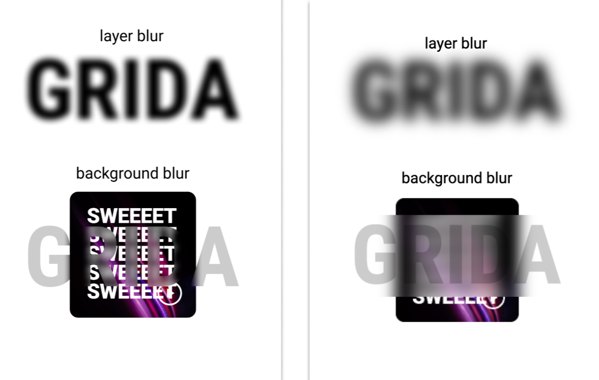

# Figma blur effects


- layer blur - blur this layer
- background blur - blur the background behind the layer (filter)

Thankfully, figma does not have multiple blur (same blur). Each only one blur effects can be applied. (hooray 🥳)

The possible combinatons would be,

- none
- layer blur
- background blur
- layer blur + background blur

_References_

- [Figma#BlurEffect](https://www.figma.com/plugin-docs/api/Effect/#blureffect)

<br/>

In figma, `blur effect` is supported for text as well as various shapes.

However, in actual figma, when applying the text blur effect, it supports the text **`path`** by applying the blur to that **`path`**. Therefore, if you provide blur to text in a normal way, the following problem occurs.

> 
>
> _left:figma, right:designto-code_

Therefore, girda describes (by text) as a dichotomy only in that document.

## **Text**

### layer blur

As described above, the screen designed in figma and the screen created by substituting the same value in the code are different. The reason that the screen designed in figma looks darker is because it creates a **`path`** that matches the text and gives a **`layer blur`** to the **`path`**.

But in general, providing a **`layer blur`** directly to text in a design is not a healthy design, so **grida doesn't provide this.**

### background blur

For text's **`background blur`**, the same screen as the designed screen does not appear for the same reason as layer blur. A background blur is applied to the layer box.

In the case of text, **`blur background`** is a method that is often used in design, so we plan to support it in the way below.

**using clipPath and `clip-path`**

**must read**
_[`reference`](https://codepen.io/chriscoyier/pen/YzKWYWa)_

**structure**

typesciprt

```typescript
<>
  <span className="background-blur" id="text-grida">
    <svg aria-hidden="true" className="background-blur visually-hidden">
      <clipPath id="text-background-blur">
        <text dominant-baseline="hanging" text-anchor="middle" x="50%" y="0em">
          GIRDA
        </text>
      </clipPath>
    </svg>
  </span>
</>
```

```css
.background-blur {
  width: 100%;
  font: 8vw system-ui, sans-serif;
  font-weight: 900;
  height: 150px;
}
@supports (backdrop-filter: blur(12px)) {
  .visually-hidden {
    position: absolute;
    top: -9999px;
    left: -9999px;
  }
  #text-grida {
    backdrop-filter: blur(12px);
    background: rgba(255, 255, 255, 0.2);
    clip-path: url(#text-background-blur);
  }
}
```

[example](https://codepen.io/you-j/pen/PojvOrr)

## Web - css

- layer blur - [`filter`](https://developer.mozilla.org/en-US/docs/Web/CSS/filter)
- background blur - [`backdrop-filter`](https://developer.mozilla.org/en-US/docs/Web/CSS/backdrop-filter)
- [`blur()`](<https://developer.mozilla.org/en-US/docs/Web/CSS/filter-function/blur()>)

- text layer blur - [`reference (text-shadow)`](https://css-tricks.com/fun-with-blurred-text/)
- text background blur - [`reference (clip-path)`](https://css-tricks.com/a-glassy-and-classy-text-effect/)
- [`text-shadow`](https://developer.mozilla.org/en-US/docs/Web/CSS/text-shadow)
- [`<clipPath>`](https://developer.mozilla.org/en-US/docs/Web/SVG/Element/clipPath)
- [`<clip-path>`](https://developer.mozilla.org/en-US/docs/Web/CSS/clip-path)

**Background blur with `backdrop-filter: blur()`**

```css
backdrop-filter: blur(2px);
```

**Layer blur with `filter: blur()`**

```css
filter: blur(4px);
```

## Flutter

<!-- Adding layer / background blur in flutter is little bit more trickier than css -->

- layer blur - [`ImageFiltered`](https://api.flutter.dev/flutter/widgets/ImageFiltered-class.html)
- background blur - [`BackdropFilter`](https://api.flutter.dev/flutter/widgets/BackdropFilter-class.html)
- [`ImageFilter.blur()`](https://api.flutter.dev/flutter/dart-ui/ImageFilter/ImageFilter.blur.html)

**layer blur with `ImageFiltered`**

```dart
ImageFiltered(
  imageFilter: ImageFilter.blur(sigmaX: 3.0, sigmaY: 3.0),
  child: child
)
```

**background blur with `BackdropFilter`**

```dart
BackdropFilter(
  filter: ImageFilter.blur(sigmaX: 3.0, sigmaY: 3.0),
  child: child
)
```
